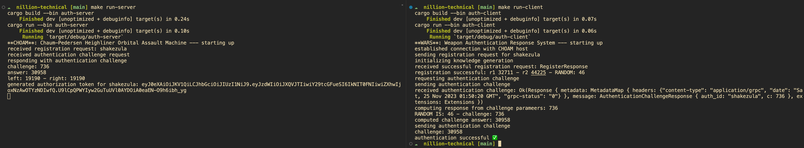

# CHOAM

> **CHOAM**: The Chaum-Pedersen Heighliner Orbital Assault Machine.

I've been reading a lot of Dune lately, so I present to you *CHOAM*, a Chaum-Pedersen protocol implementation in GRPC and Rust. Chaum-Pedersen is a Sigma protocol for [zero-knowledge proofs](https://en.wikipedia.org/wiki/Zero-knowledge_proof).

## I am not a cryptographer, and I'm certainly not *your* cryptographer

This is not production ready code, and it should absolutely not be used for anything in production period.

## Running CHOAM

To test this script out, you need to run the server locally and then run the client to authenticate with the server.

`cargo run-server` to run the CHOAM server.
`cargo run-client` to run the client.

The client runs an automatic connection protocol and stores the token it receives from the authentication request.

## Related Reading

- [Zero-knowledge proof](https://en.wikipedia.org/wiki/Zero-knowledge_proof)
- [Publicly verifiable secret sharing](https://en.wikipedia.org/wiki/Publicly_Verifiable_Secret_Sharing)

*The spice must flow.*
